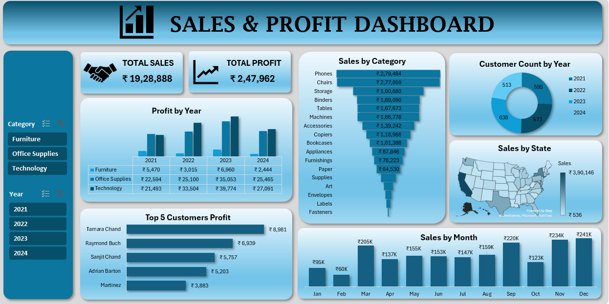

# 📊 Sales Data Analysis (Excel Project)

## 📌 Project Overview
This project focuses on analyzing retail sales data using **Excel**. It uses raw transactional data, pivot tables, and dashboards to derive insights into sales, profit, customer behavior, and regional performance.  

The objective is to demonstrate how Excel can be applied to transform raw datasets into meaningful business insights.

---

## 🗂️ Project Structure
- **Data Sheet**  
  Contains raw transactional data including order date, customer, state, category, sub-category, sales, quantity, and profit.

- **Pivot Sheet**  
  Includes pivot tables for aggregations such as:
  - Total Sales and Profit by Year  
  - Sales by Category & Sub-category  
  - State-wise Sales  
  - Sales by Month  
  - Top Customers by Profit  

- **Dashboard Sheet**  
  (To be created using Pivot outputs) Visualizes KPIs, trends, and top contributors.

---

## ⚙️ Technologies Used
- **Microsoft Excel**  
  - Pivot Tables  
  - Charts & Graphs  
  - Dashboard design  

---

## 🚀 How to Use
1. Open the Excel file in Microsoft Excel.  
2. Explore the **Data** sheet for raw sales records.  
3. Use the **Pivot** sheet to see aggregated metrics.  
4. View or build visualizations in the **Dashboard** sheet.  

---

## 📊 Sample Dashboard
Example visualization of sales trends and KPIs:  

  

---

## 📊 Key Insights
- Yearly trends in **sales and profit** highlight overall growth patterns.  
- **Category & Sub-category analysis** shows top-performing products.  
- **State-wise sales** reveal geographic opportunities.  
- **Top customers** contribute significantly to profitability.  

---

## 📝 Author
Developed by **Suyash Shewale**  
An Excel-based sales analysis project with pivot tables and dashboards.
